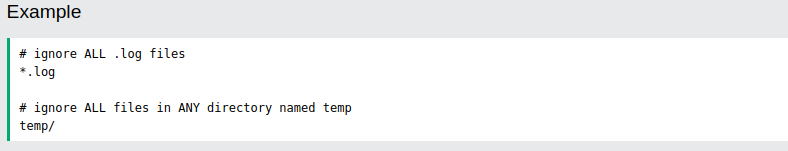

*Created on: 20.10.2022 3:33 AM*

# Git Ignore
When sharing your code with others, there are often files or parts of your project, you do not want to share.
Git can specify which files or parts of your project should be ignored by Git using a **.gitignore** file.
Git will not track files and folders specified in **.gitignore**. However, the **.gitignore** file itself IS tracked by Git.

## Create .gitignore
1. Go to the root of your local Git, and create it: `touch .gitignore`
2. Open **.gitingore** file & add the names of files/folders that you don't want GIT to tarck. E.g.: 

Now all .log files and anything in temp folders will be ignored by Git.

> **Note:** In this case, we use a single .gitignore which applies to the entire repository.
It is also possible to have additional .gitignore files in subdirectories. These only apply to files or folders within that directory.

> **Local and Personal Git Ignore Rules**
It is also possible to ignore files or folders but not show it in the distributed **.gitignore** file.
These kinds of ignores are specified in the **.git/info/exclude** file. It works the same way as **.gitignore** but are not shown to anyone else.

 

## Rules for .gitignore
<table style="border-collapse: collapse; border-spacing: 0; width: 100%; display: table; border: 1px solid #ccc; margin: 20px 0;">
<tbody><tr>
<th style="width:200px">Pattern</th>
<th>Explanation/Matches</th>
<th style="width:150px">Examples</th>

</tr>
<tr>
<td>&nbsp;</td>
<td>Blank lines are ignored</td>
<td>&nbsp;</td>

</tr>
<tr>
<td># <em>text comment</em></td>
<td>Lines starting with # are ignored</td>
<td>&nbsp;</td>

</tr>
  <tr>
<td><em>name</em></td>
<td>All <em>name</em> files, <em>name</em> folders, and files and folders in any
<em>name</em> folder</td>
<td>/name.log /name/file.txt /lib/name.log</td>

  </tr>
  <tr>
<td><em>name</em>/</td>
<td>Ending with / specifies the pattern is for a folder. Matches all files and folders in any
<em>name</em> folder</td>
<td>/name/file.txt /name/log/name.log  <strong>no match:</strong> /name.log</td>

  </tr>
  <tr>
<td><em>name</em>.<em>file</em></td>
<td>All files with the <em>name.file</em></td>
<td>/name.file /lib/name.file</td>

  </tr>
  <tr>
<td><em>/name</em>.<em>file</em></td>
<td>Starting with / specifies the pattern matches only 
files in the root folder</td>
<td>/name.file  <strong>no match:</strong> 
/lib/name.file</td>

  </tr>
  <tr>
<td><em>lib/name</em>.<em>file</em></td>
<td>Patterns specifiing files in specific folders are always realative to root 
(even if you do not start with / )</td>
<td>/lib/name.file  <strong>no match:</strong> 
name.file /test/lib/name.file</td>

  </tr>
  <tr>
<td>**<em>/lib/name.file</em></td>
<td>Starting with ** before / specifies that it matches any folder in the 
repository. Not just on root.</td>
<td>/lib/name.file /test/lib/name.file</td>

  </tr>
  <tr>
<td>**<em>/name</em></td>
<td>All <em>name</em> folders, and files and folders in any
<em>name</em> folder</td>
<td>/name/log.file /lib/name/log.file /name/lib/log.file</td>

  </tr>
  <tr>
<td>/lib/**<em>/name</em></td>
<td>All <em>name</em> folders, and files and folders in any
<em>name</em> folder within the lib folder.</td>
<td>/lib/name/log.file /lib/test/name/log.file /lib/test/ver1/name/log.file 
 <strong>no match:</strong> 
/name/log.file</td>

  </tr>
  <tr>
<td>*.<em>file</em></td>
<td>All files withe <em>.file</em> extention</td>
<td>/name.file /lib/name.file</td>

  </tr>
  <tr>
<td>*<em>name</em>/</td>
<td>All folders ending with <em>name</em></td>
<td>/lastname/log.file /firstname/log.file</td>

  </tr>
  <tr>
<td><em>name</em>?.<em>file</em></td>
<td>? matches a <strong>single</strong> non-specific character</td>
<td>/names.file /name1.file  <strong>no match:</strong> 
/names1.file</td>

  </tr>
  <tr>
<td><em>name</em>[a-z].<em>file</em></td>
<td>[<em>range</em>] matches a <strong>single</strong> character in the 
specified range (in this case a character in the range of a-z, and also be 
numberic.)</td>
<td>/names.file /nameb.file  <strong>no match:</strong> 
/name1.file</td>

  </tr>
  <tr>
<td><em>name</em>[abc].<em>file</em></td>
<td>[<em>set</em>] matches a <strong>single</strong> character in the specified 
set of characters (in this case either a, b, or c)</td>
<td>/namea.file /nameb.file  <strong>no match:</strong> 
/names.file</td>

  </tr>
  <tr>
<td><em>name</em>[!abc].<em>file</em></td>
<td>[!<em>set</em>] matches a <strong>single</strong> character, <strong>except</strong> 
the ones spesified in the set of characters (in this case a, b, or c)</td>
<td>/names.file /namex.file  <strong>no match:</strong> 
/namesb.file</td>

  </tr>
  <tr>
<td>*.<em>file</em></td>
<td>All files withe <em>.file</em> extention</td>
<td>/name.file /lib/name.file</td>
  </tr>
  <tr>
<td><em>name</em>/ !<em>name</em>/secret.log</td>
<td>! specifies a negation or exception. Matches all files and folders in any
<em>name</em> folder, except name/secret.log</td>
<td>/name/file.txt /name/log/name.log  <strong>no match:</strong> /name/secret.log</td>

  </tr>
  <tr>
<td>*.<em>file </em>!<em>name</em>.file</td>
<td>! specifies a negation or exception. All files withe <em>.file</em> extention, except name.file</td>
<td>/log.file /lastname.file  <strong>no match:</strong> 
/name.file</td>

  </tr>
  <tr>
<td>*.<em>file </em>!<em>name</em>/*<em>.file</em> junk.*</td>
<td>Adding new patterns after a negation will re-ignore a previous negated file All files withe <em>.file</em> extention, except the ones in <em>name</em> 
folder. Unless the file name is junk</td>
<td>/log.file /name/log.file  <strong>no match:</strong> 
/name/junk.file</td>

  </tr>
</tbody></table>

 

# SSH
Up to this point, we have used HTTPS to connect to our remote repository.

HTTPS will usually work just fine, but you should use SSH if you work with unsecured networks. And sometimes, a project will require that you use SSH.

## What is SSH

SSH is a secure shell network protocol that is used for network management, remote file transfer, and remote system access.

SSH uses a pair of SSH keys to establish an authenticated and encrypted secure network protocol. It allows for secure remote communication on unsecured open networks.

SSH keys are used to initiate a secure "handshake". When generating a set of keys, you will generate a "public" and "private" key.

The "public" key is the one you share with the remote party. Think of this more as the lock.

The "private" key is the one you keep for yourself in a secure place. Think of this as the key to the lock.

SSH keys are generated through a security algorithm. It is all very complicated, but it uses prime numbers, and large random numbers to make the public and private key.

It is created so that the public key can be derived from the private key, but not the other way around.

## Generating an SSH Key Pair
Generate a new private SSH key and add it to the SSH agent. 
Start by creating a new key, using your email as a label: 
`ssh-keygen -t rsa -b 4096 -C "test@w3schools.com"` # it will ask for file location where you want to save the new key (on Fedora default location is "/home/redcomp/.ssh/id_rsa") and passphrase

Now we add this SSH key pair to the SSH-Agent: `ssh-add id_rsa`
Now the SSH key pair is ready to use.

 

# GitHub & SSH
Using the SSH protocol, you can connect and authenticate to remote servers and services. With SSH keys, you can connect to GitHub without supplying your username and personal access token at each visit. You can also use an SSH key to sign commits.

## Copy the SSH Public Key
- Copy the public key (.ssh/id_rsa.pub) to clipboard.
- On GitHub, go to Settings -> SSH and GPG keys. Click on "New SSH key" button.
- In the "Title" field, add a descriptive label for the new key. And paste the public SSH key into the "Key" field, and click "Add SSH Key".

## Test SSH Connection to GitHub
Now we can test our connection via SSH to GitHub: `ssh -T git@github.com`
If the last line contains your username on GitHub, you are successfully authenticated!

### Add New GitHub SSH Remote
Now we can add a new remote via SSH to our Git. First, get the SSH address from our repository on GitHub by clicking on Code button.
Then use that address to add a new ssh-origin: `git remote add ssh-origin <SSH-URL>`

> **Note:** You can change a remote origin from HTTPS to SSH with the command: 
> `git remote set-url remote-name git@github.com:username/repository.git`