*Created on: 16.10.2022 2:49 AM*

In Git, a `branch` is a new/separate version of the main repository. Branches allow you to work on different parts of a project without impacting the main branch. When the work is complete, a branch can be merged with the main project.

## <u>Commands</u>
* **Create new branch:** `git branch [branch_name]` or `git checkout -b [branch_name]`
* **Get the list of all branches:** `git branch`
* **Switch branch:** `git checkout [branch_name]`
* **Merge branch:** `git merge [branch_name]` # merge specified branch into the current one
* **Rename branch:** `git branch -m <branch_name>`
* **Delete branch:** `git branch -d <branch_name>`
 
## <u>Example</u>
Lets say we have a repo named **myproject**:
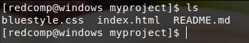

**Adding new feature:** Suppose, we want to add a new feature to the project.
We are working in our local repository, and we do not want to disturb or possibly wreck the main project.
So we create a new branch:
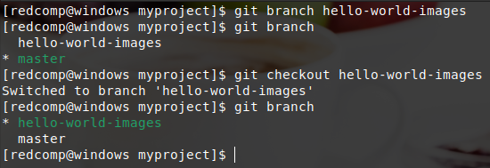

Now we have moved our current workspace from the master branch, to the new branch. Now we can start working on our new feature. Once done, stage & commit:
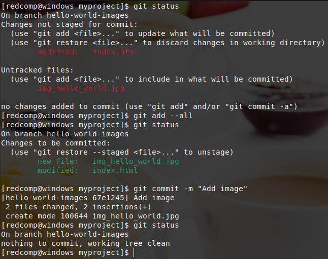

Now we have a new branch, that is different from the master branch:
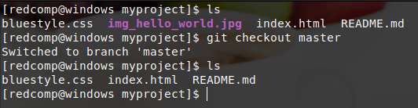
  
**Emergency:** Now imagine that we are not yet done with hello-world-images, but we need to fix an error on master. I don't want to mess with master directly, and I do not want to mess with hello-world-images, since it is not done yet. So we create a new branch to deal with the emergency:
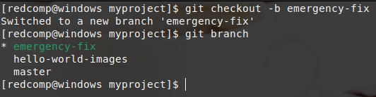

Now we have created a new branch from master, and checkout to it. We can safely fix the error without disturbing the other branches. 
Fix the error & commit the changes:

**Merge:** Now we have a fix ready for master, and we need to merge the two branches.
First, we need to change to the master branch. Then, we merge the current branch (master) with emergency-fix:
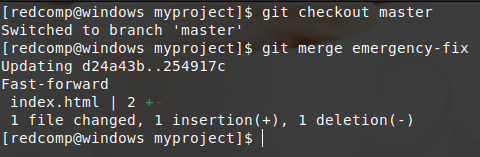

Since the emergency-fix branch came directly from master, and no other changes had been made to master while we were working, Git sees this as a continuation of master. So it can "Fast-forward", just pointing both master and emergency-fix to the same commit.
As master and emergency-fix are essentially the same now, we can delete emergency-fix, as it is no longer needed:
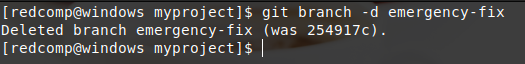

**Merge Conflict:** 
Now we can move over to hello-world-images and keep working. Add some line in index.html:
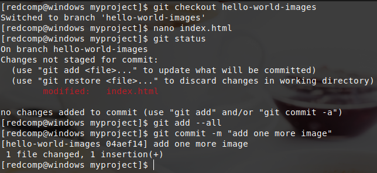

Now we are ready to merge hello-world-images into master. But what will happen to the changes we recently made in master? Because when we merge all the changes of hello-world-images will be copied to master branch but in this case, there are some changes are made to master branch which hello-world-images doesn't containt. That's why Git will throw conflict error:
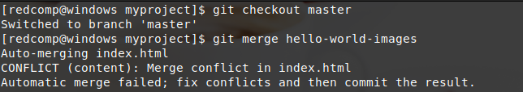

The merge failed, as there is conflict between the versions for index.html. Let us check the status:
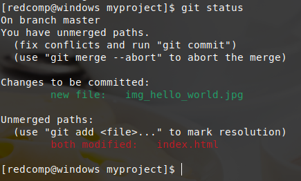

This confirms there is a conflict in index.html, but the image file is ready and staged to be committed.
So we need to fix that conflict. Open index.html:
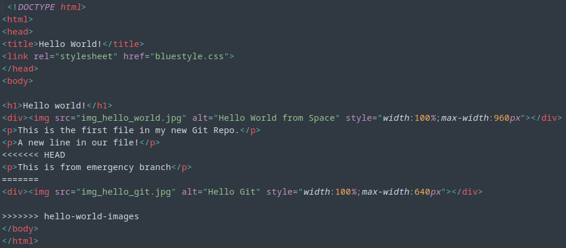

We can see the differences between the versions of index.html. We can edit the file and decide what to keep and what to remove:
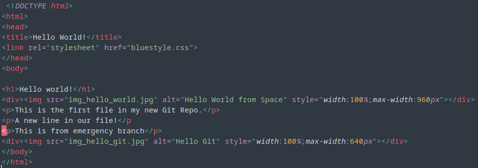

Now we can stage index.html and check the status:
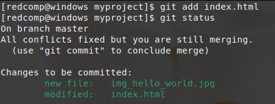

The conflict has been fixed, and we can use commit to conclude the merge:
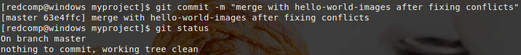

And delete the hello-world-images branch:
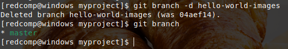

