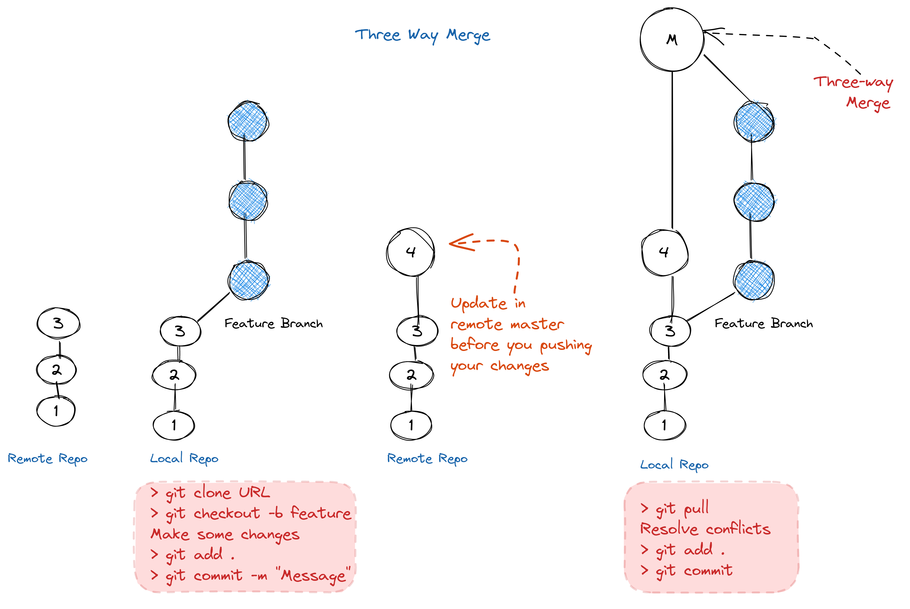
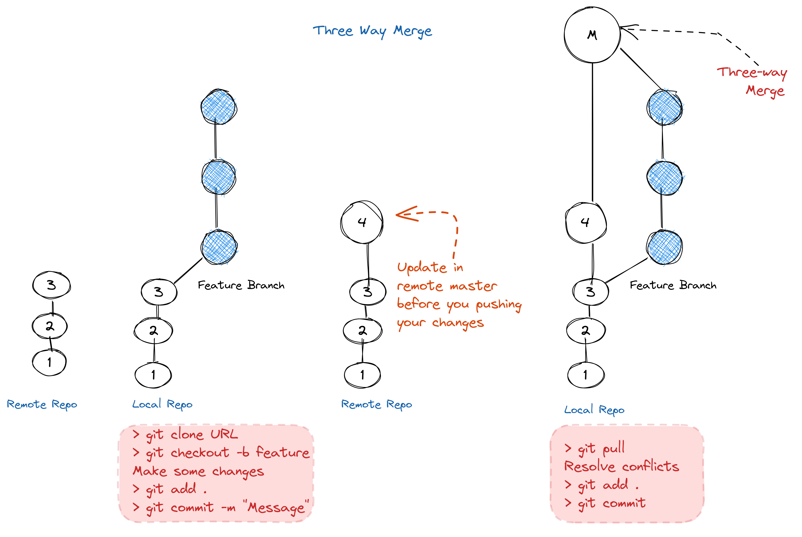
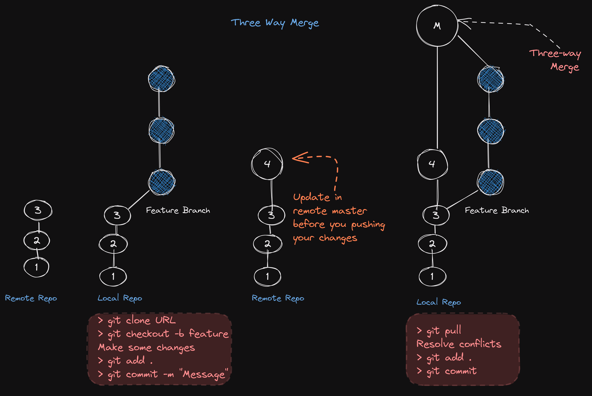
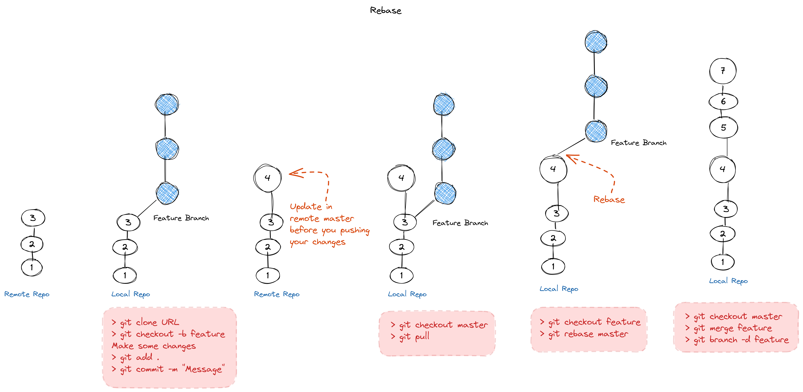
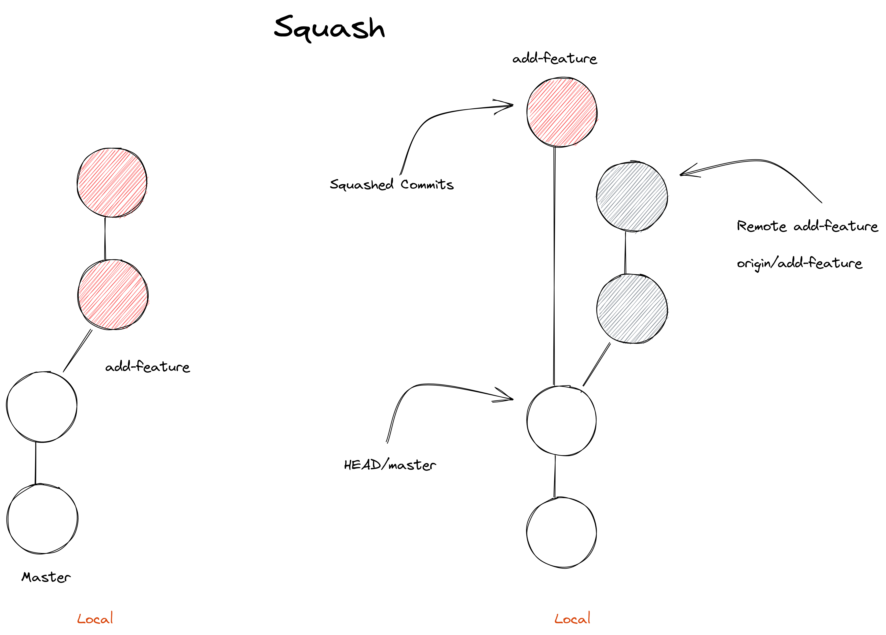

# GitHub: Working with Remote

### Basic Commands

- git clone URL // Git clone is used to clone a remote repository into a local workspace

- git push // Git push is used to push commits from your local repo to a remote repo

- git pull // Git pull is used to fetch the newest updates from a remote repository

- If we want to make a change to a remote branch, Pull the remote branch, merge it with the local branch, 
then push it back to its origin.
 

- View Remote:

    git remote  // Lists remote repos
    
    git remote -v // List remote repos verbosely
    
    git remote show origin // get more info. about remote
    
    git branch -r // List of remote branches that Git is tracking

If someone has updated a repository since the last time you synchronize your local copy, Git will tell you that it's time to do an
update. If you have your own local changes when you pull down the code from the remote repo, you might need to fix merge
conflicts before you can push your own changes. In this way Git let's multiple people work on the same project at the same time.
When pulling new code it will merge the changes automatically if possible or will tell us to manually perform the integrations, if there 
are conflicts. 

So when working with remotes the workflow for making changes has some extra steps. Will still modify stage and commit our local changes.
After committing, we'll fetch any new changes from the remote repo manually merge if necessary and only then will push our changes to the 
remote repo. 

Git supports a variety of ways to connect to a remote repository. Some of the most common are using the HTTP, HTTPS and SSH protocols
and their corresponding URLs. HTTP is generally used to allow read only access to a repository. In other words, it lets people clone the contents of
your repo without letting them push new contents to it. Conversely HTTPS and SSH, both provide methods of authenticating
users so you can control who gets permission to push. 

Remote repositories have a name assigned to them, by default, the assigned name is origin.
This lets us track more than one remote in the same Git directory. After cloning the remote repo we can see the config

### Basic Remote Workflow
    1. Pull. pull changes from remote repo to sync local repo before pushing your changes 
        > git pull // downloades all remote branches
        > git pull origin/master // downlaodes remote master branch 
    2. Review. review the conflict, if any. 
        To view commit history > git log --graph --oneline --all
        To view actual changes in file > git log -p origin/master
    3. Resolve. resolve- resolve the conflict by manually editing the conflict file, also, search for '>>>' to ensure that no conflict left
    4. commit
    5. push

### Fetching new changes: Before pushing our changes to remote our local repo must be updated/synced with remote. 
    To do that first fetch the remote changes then merge them to local branches:

    1. First check if any changes made to remote branch > git remote show origin
    
    2. If yes, then fetch > git fetch
        After fetching remote changes, we can view the commit log of origin master:
        > git log origin/master  

        Also, we can checkout to remote branches to view the working tree:
        > git checkout origin/master

    3. Merge remote master into local master
        git checkout master 
        git merge origin/master

    4. Now, we can push our changes > git push origin/master

### Pulling: Since fetching and merging is very common operation, we can do it in single step:
    > git pull // download all remote branches and automatically try to merge them

    It will fetch the remote changes (all the remote branches) and merge them into local repo.
    
    Suppose, pulling fetches a new remote branch which doesn't exist in local repo. All you have to 
    do to have the new remote branch is:

        > git checkout new_remote_branch_name

    If we want to get the contents of remote branches without automatically merging any contents 
    into the local branches, we can call 

        > git remote update // Fetches the most up-to-date objects

    This will fetch the contents of all remote branches so that we can just call checkout or merge as needed.

### Pull-Merge-Push Workflow

#### Case 1
**Master branch merge without conflict:**
You cloned the repo. Somebody added commits to remote repo. You pull the remote changes. Fast forward merge.

#### Case 2 
**Master branch merge with conflict:**
You cloned the repo. Added some commits to your master. Ready to push, but a teammate/collaborator updated remote. Now you have to sync your master with remote before pushing. If you do `git pull`, merge conflict may arise, results in Three-way-merge. When Git needs to do a three-way merge, we end up with a separate commit for merging the branches back into the main tree. 

#### Case 3 
**Feature branch merge with REBASE:** 
When using Git to work on a new feature or a big refactor of some kind, it's recommended best practice to create separate branches.
There are many advantages to doing this. For example, it might take you a while to finish a new feature and in the meantime, there could be a critical bug that needs fixing in the main branch of the code. By having separate branches, you can fix the bug in the main branch, release a new version and then go back to working on your feature without having to integrate your code before it's ready. Another advantage of working in separate branches is that you could even release two or more versions out of the same tree. One being the stable version and the other being the beta version. That way, any disruptive changes can be tested on
a few users or computers before they're fully released. 
    
So, you  create afeature branch on local repo, made commits. Before you merge it to master, push the feature branch to remote. So, that the collaborators can review it.
Then you can push the feature branch > git push -u origin feature
Once feature branch has been properly reviewed and tested, it can get merged back into the master branch. This can be done by us or by someone else.
One option is to use the git merge command that we discussed earlier. Another option is to use the git rebase command. Rebasing means changing the base commit that's used for our branch.

<!-- 

 -->

If we perform merge operation, since somebody already added update to remote, it will cause Three-way-merge. If only one of the branches has new changes when we try to merge them, Git will be able to fast forward and apply the changes. But if both branches have new changes when we try to merge, Git will create a new merge commit for the three way merge. 
The problem with three way merges is that because of the split history, it's hard for us to debug when an issue is found in our code, and we need to understand where the problem was introduced.

We can use Rebase instead. By changing the base where our commits split from the branch history, we can replay the new commits on top of the new base.This allows Git to do a fast forward merge and keep history linear. 

In our case, we can change the base of feature branch to the latest commit of the master branch.

// Update the master
> git checkout master
> git pull

// Rebase feature againt master
> git checkout feature
> git rebase master // Chagne the base of current branch i.e. feature to HEAD of master 

After rebase we can merge feature to master. And can delete the feature branch remotely & localy and the push master to server. 
Now, we have linear commit history on remote. It will be easier for contribute to find the commit which introduced the bugs when bug occurs.

Delete remote branch > git push --delete origin feature
Delete local branch > git branch -d feature
Now, changes can be pushed to remote repo > git push

So, to sum up, We had a feature branch created against an older commit from master. So we rebased our feature branch against the latest commit from master and then merged the feature branch back into master. 

#### Case 4 
**Master branch Rebase:**
One common example is to rebase the changes in the master branch when someone else also made changes and we want to keep history linear. 
This is a pretty common occurrence when you're working on a change that's small enough not to need a separate branch and your collaborators just happened to commit something at the same time. 

- Add commits in master
- Somebody added commit in origin master
- Fetch the changes
- Rebase > git rebase origin/master // change the base of master to the lastest commit of origin/master
- In case of conflict, resolve the conflict
- Finish the rebase by adding your changes to staging area and then rebase
    > git addd
    > git rebase --continue
- Now, our changes can be pushed to remote repo
    > git push

### Collaboration:
If you're trying to learn a new technology, it's a great idea to practice
your skills by contributing to a project that uses that technology.
To do that, you'll need to know how to interact with the project.
This includes how to send bug fixes, how to make sure that your fixes are applied,
and even how to figure out which fixes are needed. 

**Workflow:**
    1. Fork
    2. Clone the fort on local
    3. Create a separate branch 
    4. Work on the feature
    5. Commit 
    6. Push
    7. Create Pull Request
    8. Reply to Maintainers feedback 

#### Pull Request Squash

If your pull request has multiple commits, the maintainers might ask for squashing the commits into one. 
Suppose, you create a branch, add-feature to work on a feature. Once, done, you created a commit and pushed it and created a pull request.
Maintainer asked you to do some modification in your code. So, you did the modification, add a commit and pushed again.
Now, your pull request has two commits. The maintainer asked you to squash those two commits into one.

**How to do that:**
    - Rebase the add-feature branch against master using an interactive (-i) window to squash commits:
        > git rebase -i master 

    - The interactive window will show the list of commits that you added in add-feature branch. 
    - 'pick' the top commit and 'squash' rest of the commits, save the file
    - Git, will give you an another file to modify the commit message. Modify and Save.
    - Check the log:
        > git show --graph --oneline --all

- Now, your two commits have squashed into one. 
- Now, push add-feature to remote forcefully cause remote has two commits in add-feature. Those two commits will be replaced by 
    squashed commit:
    > git push -f
- Go to GitHub, your pull request will be updated.
- Done

#### Code Review
    Suppose you submit a pull request and after reviewing your code the maintainer asked for some changes.

    - Make changes as per maintaners requirements
    - Add commit with amend, this will replace the previous commit with the new one. This way you will have only one commit.
    Otherwise, there will be two commits and the maintainer will ask you to squash them.
    - Push the ammended commit 
        > git push -f // need to be forced as amended commit will replace the remote commit
    - Go to GitHub, mark "Resolve' all the open Code Reviews and re-submit. 

#### Issue Tracker
    Issue Tracker let us list the tasks, bugs, etc. GitHub has its own issue tracker.
    
    On GitHub:
        - Go to issue tab
        - See, what feature you want to work on or bug you want to fix
        - Ask maintainer to assign it to you
        - Once the issue is assigned to you, you can start working on it.
        - Add commit. In commit message window mention the issue no like - 'Closes #4', at the last line of your commit message
        - Mentioning issue in commit will qutomatically close the issue as soon as you make a pull request
        - Now, you can push and create a pull request

### CI/CD:
    - CI (Continuous Integration): Test code whenever there's a change i.e. It will run whenever there's a new commit in the main branch 
    - Pipeline: List of tasks to perform for each commit like - compile the program, run the unit test, run the integration test, and deploy the project on Test Instance. 
    - Artifacts: Files generate as part of Pipeline like- compiled files, pdf's for ducumentation, etc.
    - CD: (Continuous Delivery): New changes are deployed often this helps detect bugs in early stage